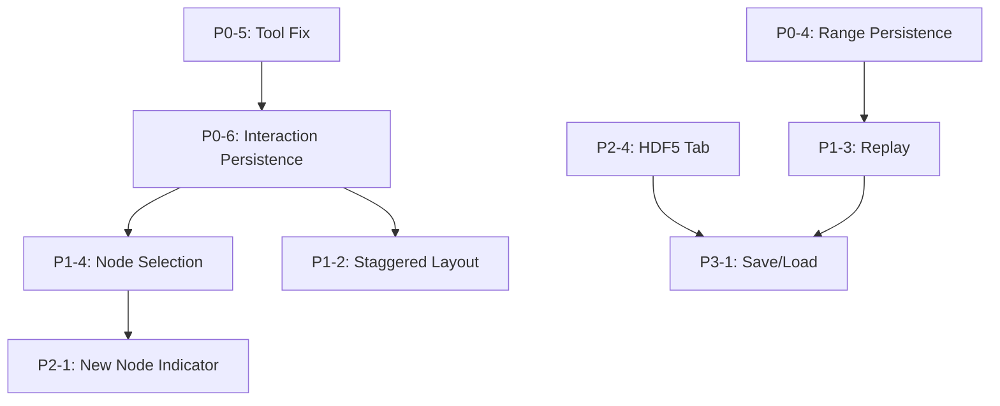

# Juniper Canopy Implementation Plan

**Last Updated:** 2025-12-12  
**Version:** 1.0.0  
**Status:** Active

## Table of Contents

- [Juniper Canopy Implementation Plan](#juniper-canopy-implementation-plan)
  - [Table of Contents](#table-of-contents)
  - [Overview](#overview)
    - [Current State](#current-state)
  - [Priority Matrix](#priority-matrix)
    - [Summary by Priority](#summary-by-priority)
  - [Phase 0: Core UX Stabilization (P0)](#phase-0-core-ux-stabilization-p0)
    - [P0-1: Training Controls Button State Fix](#p0-1-training-controls-button-state-fix)
    - [P0-2: Meta-Parameters Apply Button](#p0-2-meta-parameters-apply-button)
    - [P0-3: Top Status Bar Status/Phase Updates](#p0-3-top-status-bar-statusphase-updates)
    - [P0-4: Training Metrics Graph Range Persistence](#p0-4-training-metrics-graph-range-persistence)
    - [P0-5: Network Topology Pan/Lasso Tool Fix](#p0-5-network-topology-panlasso-tool-fix)
    - [P0-6: Network Topology Interaction Persistence](#p0-6-network-topology-interaction-persistence)
    - [P0-7: Network Topology Dark Mode Info Bar](#p0-7-network-topology-dark-mode-info-bar)
  - [Phase 1: High-Impact Enhancements (P1)](#phase-1-high-impact-enhancements-p1)
    - [P1-1: Candidate Node Info Section Fix](#p1-1-candidate-node-info-section-fix)
    - [P1-2: Network Topology Staggered Layout](#p1-2-network-topology-staggered-layout)
    - [P1-3: Training Metrics Replay Functionality](#p1-3-training-metrics-replay-functionality)
    - [P1-4: Node Selection Interactions (Phase 1)](#p1-4-node-selection-interactions-phase-1)
  - [Phase 2: Polish \& Medium-Priority Features (P2)](#phase-2-polish--medium-priority-features-p2)
    - [P2-1: Most Recently Added Node Indicator](#p2-1-most-recently-added-node-indicator)
    - [P2-2: Unique Image Download Names](#p2-2-unique-image-download-names)
    - [P2-3: About Tab](#p2-3-about-tab)
    - [P2-4: HDF5 Snapshot Tab (Read-Only)](#p2-4-hdf5-snapshot-tab-read-only)
  - [Phase 3: Advanced Features \& Infrastructure (P3)](#phase-3-advanced-features--infrastructure-p3)
    - [P3-1: Training Metrics Save/Load](#p3-1-training-metrics-saveload)
    - [P3-2: Network Topology 3D View](#p3-2-network-topology-3d-view)
    - [P3-3: Cassandra Integration Tab](#p3-3-cassandra-integration-tab)
    - [P3-4: Redis Integration Tab](#p3-4-redis-integration-tab)
  - [Dependencies](#dependencies)
    - [Critical Dependencies](#critical-dependencies)
    - [Shared Dependencies](#shared-dependencies)
  - [Risk Assessment](#risk-assessment)
    - [High-Risk Areas](#high-risk-areas)
    - [Medium-Risk Areas](#medium-risk-areas)
    - [Low-Risk Areas](#low-risk-areas)
  - [Implementation Details](#implementation-details)
  - [Test Coverage Requirements](#test-coverage-requirements)
  - [Change Log](#change-log)

---

## Overview

This document provides a comprehensive implementation plan for all fixes and enhancements identified in the [DEVELOPMENT_ROADMAP.md](../DEVELOPMENT_ROADMAP.md). Items are prioritized based on user impact, complexity, and dependencies.

### Current State

- **Test Coverage:** 86% (1217 passed, 1 failed, 32 skipped)
- **Target Coverage:** 90%
- **Core Architecture:** Dash/Plotly frontend with FastAPI backend, WebSocket communication
- **Demo Mode:** Functional

---

## Priority Matrix

| Priority | Description                                 | Target Timeline      |
| -------- | ------------------------------------------- | -------------------- |
| **P0**   | Critical bugs breaking core functionality   | Phase 0 (1-2 days)   |
| **P1**   | High-impact features and important fixes    | Phase 1 (2-4 days)   |
| **P2**   | Medium-priority polish and features         | Phase 2 (2-3 days)   |
| **P3**   | Low-priority and infrastructure-heavy items | Phase 3 (multi-week) |

### Summary by Priority

| Priority | Fixes | Enhancements | New Tabs | Total |
| -------- | ----- | ------------ | -------- | ----- |
| P0       | 6     | 0            | 0        | 6     |
| P1       | 1     | 3            | 0        | 4     |
| P2       | 1     | 2            | 2        | 5     |
| P3       | 0     | 2            | 2        | 4     |

---

## Phase 0: Core UX Stabilization (P0)

**Objective:** Fix critical bugs that make the dashboard feel unreliable.  
**Estimated Effort:** 1-2 days  
**Files Affected:** `dashboard_manager.py`, `metrics_panel.py`, `network_visualizer.py`

### P0-1: Training Controls Button State Fix

**Issue:** Buttons stay in "pressed" state and become unclickable after first press.

**Root Cause:** Mismanaged `dcc.Store`/callback logic around `button-states` and `last-button-click`.

**Implementation:**

```bash
Location: src/frontend/dashboard_manager.py
Methods: _handle_training_buttons_handler, _handle_button_timeout_and_acks_handler

1. Make button-states store the single source of truth
2. Reset n_clicks state or interpret clicks idempotently  
3. Update button-states to re-enable after backend acknowledgment
4. Add explicit timeout handler (5s max)
5. Clear loading state on success/failure
```

**Complexity:** Medium  
**Risk:** Medium  
**Tests Required:** Button state transitions, debouncing, timeout behavior

---

### P0-2: Meta-Parameters Apply Button

**Issue:** Meta-parameters not applied after change; updates should be manual.

**Implementation:**

```bash
Location: src/frontend/dashboard_manager.py
Changes:
1. Add "Apply Parameters" button below meta-parameter inputs
2. Create dcc.Store for "pending" vs "applied" parameters
3. Only send updates to backend on Apply button click
4. Disable Apply button when no changes pending
5. Visual indicator showing unsaved changes
```

**Complexity:** Medium  
**Risk:** Medium  
**Tests Required:** Parameter change tracking, Apply button behavior

---

### P0-3: Top Status Bar Status/Phase Updates

**Issue:** Status always shows "Stopped", Phase always shows "Idle" regardless of training state.

**Root Cause:** `_update_top_status_phase_handler` not properly connected to training state.

**Implementation:**

```bash
Location: src/frontend/dashboard_manager.py
Method: _update_top_status_phase_handler, _get_status_phase_display_content

1. Wire handler to training-state-store or WebSocket data
2. Ensure state mapping matches button enable/disable logic
3. Add state transition: Idle → Running → Paused → Stopped → Completed
4. Update phase: Idle → Output → Candidate (based on training phase)
```

**Complexity:** Low-Medium  
**Risk:** Medium  
**Tests Required:** State display updates, phase transitions

---

### P0-4: Training Metrics Graph Range Persistence

**Issue:** Graph range selection resets after ~1 second.

**Root Cause:** Interval callbacks overwrite local UI state when recreating figures.

**Implementation:**

```bash
Location: src/frontend/components/metrics_panel.py

Strategy A (Preferred): Preserve layout on data updates
1. Update only figure.data in callbacks, preserve figure.layout
2. Use Patch() or figure patching to update traces without layout change

Strategy B (Alternative): Store user state
1. Store user relayoutData (axis ranges) in dcc.Store
2. Re-apply stored ranges when recreating figure
3. Clear stored state only on explicit reset

Implementation:
1. Add metrics-panel-view-state store for axis ranges
2. Add callback to capture relayoutData on user zoom/pan
3. Modify update_loss_graph/update_accuracy_graph to preserve ranges
4. Add reset button that clears view state
```

**Complexity:** Medium  
**Risk:** Medium-High  
**Tests Required:** Range persistence across updates, reset functionality

---

### P0-5: Network Topology Pan/Lasso Tool Fix

**Issue:** Pan, Lasso Select, and Box Select tools all perform Box Select function.

**Root Cause:** Plotly `dragmode`/`selectdirection` defaults or figure recreation overriding user choice.

**Implementation:**

```bash
Location: src/frontend/components/network_visualizer.py

1. Check layout.dragmode and Plotly config options
2. Remove any override forcing box select
3. Ensure dragmode persists across figure updates
4. Add network-visualizer-view-state store for tool selection
5. Apply stored dragmode on figure recreation
```

**Complexity:** Medium  
**Risk:** Medium  
**Tests Required:** Tool selection persistence, correct tool behavior

---

### P0-6: Network Topology Interaction Persistence

**Issue:** All node interactions/tools reset after ~1 second.

**Root Cause:** Interval-driven figure updates overwrite user state.

**Implementation:**

```bash
Location: src/frontend/components/network_visualizer.py

1. Avoid recreating entire figure layout unless topology changes
2. Use figure patching for data-only updates
3. Store view state (zoom, pan position, selected nodes) in dcc.Store
4. Only reset on Autoscale or Reset Axes button click
5. Compare topology hash to detect actual changes
```

**Complexity:** Medium  
**Risk:** Medium-High  
**Tests Required:** Interaction persistence, topology change detection

---

### P0-7: Network Topology Dark Mode Info Bar

**Issue:** Top information bar displays white text on white background in dark mode.

**Implementation:**

```bash
Location: src/frontend/components/network_visualizer.py

1. Add theme-state input to update_network_graph callback
2. Apply dark mode background color (#343a40) to stats bar container
3. Ensure contrast ratio meets WCAG standards
```

**Complexity:** Low  
**Risk:** Low  
**Tests Required:** Dark mode styling verification

---

## Phase 1: High-Impact Enhancements (P1)

**Objective:** Add high-value features and complete remaining important fixes.  
**Estimated Effort:** 2-4 days

### P1-1: Candidate Node Info Section Fix

**Issue:** Candidate data section visible intermittently; needs collapsibility and history.

**Implementation:**

```bash
Location: src/frontend/components/metrics_panel.py

1. Add candidate-pools-history store (keyed by pool ID)
2. Implement stable visibility with default visible state
3. Add collapsible sections for each candidate pool
4. Sort pools by recency (newest at top)
5. Collapse completed pools automatically
6. Show current pool expanded by default
```

**Complexity:** Medium  
**Risk:** Medium  
**Tests Required:** Pool history, collapse/expand, ordering

---

### P1-2: Network Topology Staggered Layout

**Issue:** Hidden nodes need staggered layout for better edge visibility.

**Implementation:**

```bash
Location: src/frontend/components/network_visualizer.py
Method: _calculate_layout

1. Keep vertical placement algorithm unchanged
2. Modify horizontal placement for hidden nodes:
   - Offset each node by ~1.5x node width from previous
   - Alternating left/right pattern for staggering
3. Re-center hidden layer horizontally:
   - Calculate midpoint of hidden layer extent
   - Align with midpoint between input and output layers
4. Add layout configuration constants
```

**Complexity:** Medium  
**Risk:** Medium  
**Tests Required:** Layout calculations, centering, edge visibility

---

### P1-3: Training Metrics Replay Functionality

**Issue:** No ability to replay training process.

**Implementation:**

```bash
Location: src/frontend/components/metrics_panel.py

Phase 1 (MVP):
1. Add Replay button (visible in top-right, respects themes)
2. Enable only when: Paused, Stopped, Completed, or Failed
3. Use existing metrics_history buffer as replay source
4. Implement time scrubber for selecting replay range
5. Start with: Normal speed + single step mode

Phase 2:
1. Add speed controls: 2x, 4x, 8x playback
2. Range selection via graph click/drag
3. Prompt if no range selected

Dependencies:
- Range persistence fix (P0-4) must be complete
- Metrics history must be accurate and bounded
```

**Complexity:** High  
**Risk:** High  
**Tests Required:** Replay state machine, speed controls, range selection

---

### P1-4: Node Selection Interactions (Phase 1)

**Issue:** No mouse click events for node selection.

**Implementation:**

```bash
Location: src/frontend/components/network_visualizer.py

Phase 1 (MVP):
1. Add node selection highlighting via clickData
2. Store selected node(s) in dcc.Store
3. Visual feedback on selection (highlight color, border)
4. Clear selection on click elsewhere

Phase 2 (deferred):
- Drag to move node
- Multi-select with Shift
- Context menu
- Label editing
```

**Complexity:** High (full), Medium (Phase 1)  
**Risk:** High  
**Tests Required:** Selection state, visual feedback

---

## Phase 2: Polish & Medium-Priority Features (P2)

**Objective:** Add polish and medium-priority features.  
**Estimated Effort:** 2-3 days

### P2-1: Most Recently Added Node Indicator

**Implementation:**

```bash
Location: src/frontend/components/network_visualizer.py

1. Detect newly added unit in update_network_graph
2. Add special styling (glowing outline, pulsing animation)
3. Highlight connected edges (muted compared to node)
4. Store highlight timestamp in dcc.Store
5. Fade out after 2 seconds or on new node addition
6. Distinct from selection indicator styling
```

**Complexity:** Medium  
**Risk:** Medium  
**Tests Required:** New node detection, animation timing

---

### P2-2: Unique Image Download Names

**Implementation:**

```bash
Location: src/frontend/components/network_visualizer.py

1. Modify Plotly toImage config for download
2. Generate filename: topology_YYYY-MM-DD_HH-MM-SS.png
3. Include network stats in filename if desired
```

**Complexity:** Low-Medium  
**Risk:** Low  
**Tests Required:** Filename generation

---

### P2-3: About Tab

**Implementation:**

```bash
Location: src/frontend/components/about_tab.py (new)
Integration: src/frontend/dashboard_manager.py

Content:
1. Application version (from config/package)
2. License information (MIT)
3. Credits and acknowledgments
4. Documentation links
5. Contact/support information
6. System information (Python version, dependencies)
```

**Complexity:** Low-Medium  
**Risk:** Low  
**Tests Required:** Content rendering, link validation

---

### P2-4: HDF5 Snapshot Tab (Read-Only)

**Implementation:**

```bash
Location: src/frontend/components/hdf5_tab.py (new)
Backend: Requires /api/snapshots endpoint

Phase 1 (Read-Only):
1. List available snapshots
2. Show details (timestamp, size, metadata)
3. Basic table with sorting

Phase 2 (Actions):
- Create new snapshot
- Restore from snapshot
- Delete snapshot
```

**Complexity:** High  
**Risk:** High  
**Dependencies:** Backend snapshot API

---

## Phase 3: Advanced Features & Infrastructure (P3)

**Objective:** Long-term features requiring significant backend work.  
**Estimated Effort:** Multi-week

### P3-1: Training Metrics Save/Load

**Dependencies:** Backend snapshot format definition, HDF5 API

**Implementation deferred until:**

- Snapshot semantics tested on backend
- Replay functionality complete
- HDF5 tab operational

---

### P3-2: Network Topology 3D View

**Complexity:** Very High  
**Risk:** High

**Implementation considerations:**

- Plotly 3D scatter or separate 3D component
- Maintain 2D as default
- Add rotation, zoom, pan in 3D space
- "Return to 2D" button
- Performance testing for large networks

---

### P3-3: Cassandra Integration Tab

**Dependencies:** Backend monitoring APIs, RBAC/permissions

**Implementation deferred until:**

- Cassandra backend APIs available
- Security review complete

---

### P3-4: Redis Integration Tab

**Dependencies:** Backend monitoring APIs, RBAC/permissions

**Implementation deferred until:**

- Redis backend APIs available
- Security review complete

---

## Dependencies

### Critical Dependencies



### Shared Dependencies

All fixes share dependencies on:

- Training state from backend (WebSocket/store)
- Consistent state model in `DashboardManager`

---

## Risk Assessment

### High-Risk Areas

1. **Figure Update Callbacks (P0-4, P0-5, P0-6, P1-3)**
   - Risk: Breaking real-time updates or memory growth
   - Mitigation:
     - Keep updates data-only where possible
     - Add tests for "zoom persists across N interval ticks"
     - Bound history buffers

2. **Training Save/Load (P3-1)**
   - Risk: Corrupted or incompatible saved states
   - Mitigation:
     - Start with read-only load
     - Version snapshot format
     - Validate on load

### Medium-Risk Areas

1. **Training Controls (P0-1, P0-2)**
   - Risk: UI/backend state mismatch
   - Mitigation:
     - Treat backend as source of truth
     - Add tests for state transitions

2. **Topology Interactions (P1-4, P3-2)**
   - Risk: Complex interaction bugs, performance
   - Mitigation:
     - Roll out incrementally
     - Keep Reset View path available

### Low-Risk Areas

- Dark mode fixes
- About Tab
- Unique filenames
- Cosmetic layout changes

---

## Implementation Details

See individual implementation documents:

- [Phase 0 Implementation](./phase0/README.md) - Core UX fixes
- [Phase 1 Implementation](./phase1/README.md) - High-impact enhancements
- [Phase 2 Implementation](./phase2/README.md) - Polish features
- [Phase 3 Implementation](./phase3/README.md) - Advanced features

---

## Test Coverage Requirements

| Phase   | Unit Tests | Integration Tests | Target Coverage |
| ------- | ---------- | ----------------- | --------------- |
| Phase 0 | 15-20      | 8-10              | 88%             |
| Phase 1 | 20-25      | 10-12             | 89%             |
| Phase 2 | 10-15      | 5-8               | 90%             |
| Phase 3 | TBD        | TBD               | 90%+            |

---

## Change Log

| Date       | Version | Changes                     |
| ---------- | ------- | --------------------------- |
| 2025-12-12 | 1.0.0   | Initial implementation plan |
