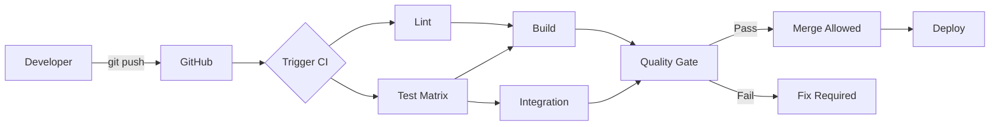

# CI/CD Complete User Manual

## Comprehensive guide for developers, reviewers, and maintainers

---

## Table of Contents

1. [Introduction](#introduction)
2. [For Developers](#for-developers)
3. [For Code Reviewers](#for-code-reviewers)
4. [For Maintainers](#for-maintainers)
5. [Workflow Deep Dive](#workflow-deep-dive)
6. [Quality Gates and Metrics](#quality-gates-and-metrics)
7. [Debugging Failed Builds](#debugging-failed-builds)
8. [Performance Optimization](#performance-optimization)
9. [Security Considerations](#security-considerations)
10. [Emergency Procedures](#emergency-procedures)

---

## Introduction

### What is CI/CD?

**Continuous Integration (CI):**

- Automatically test code on every commit
- Catch bugs early before they reach production
- Ensure code quality through automated checks

**Continuous Deployment (CD):**

- Automatically deploy passing code
- Reduce manual deployment errors
- Enable rapid iteration

### Our CI/CD Stack

```bash
GitHub Actions     # CI/CD platform
├── Conda          # Environment management
├── Pytest         # Test framework
├── Coverage.py    # Coverage tracking
├── Codecov        # Coverage reporting
├── Pre-commit     # Local quality checks
└── Artifacts      # Build outputs
```

### Pipeline Overview



---

## For Developers

### Daily Workflow

#### 1. Before You Start Coding

**Ensure pre-commit hooks are installed:**

```bash
pre-commit install
```

**Pull latest changes:**

```bash
git checkout develop
git pull origin develop
git checkout -b feature/your-feature
```

#### 2. While Coding

**Run tests frequently:**

```bash
cd src
pytest tests/ -v
```

**Check specific module:**

```bash
pytest tests/unit/test_demo_mode.py -v
```

**Watch mode (if pytest-watch installed):**

```bash
ptw tests/ -- -v
```

#### 3. Before Committing

**Run pre-commit hooks manually:**

```bash
pre-commit run --all-files
```

**Fix any formatting issues:**

```bash
black src/ --line-length=120
isort src/ --profile=black
```

**Run full test suite with coverage:**

```bash
cd src
pytest tests/ --cov=. --cov-report=term-missing
```

**Check coverage meets minimum (60%):**

```bash
# Look for line:
# TOTAL    1234   456    63%
# Must be ≥60%
```

#### 4. Committing

**Stage your changes:**

```bash
git add src/your_file.py tests/unit/test_your_file.py
```

**Commit (hooks run automatically):**

```bash
git commit -m "feat: Add new feature

- Implement feature X
- Add tests for feature X
- Update documentation
"
```

**If hooks fail:**

```bash
# Hooks auto-fix most issues, so:
git add .
git commit -m "feat: Add new feature"  # Try again
```

**Push to GitHub:**

```bash
git push origin feature/your-feature
```

#### 5. Creating Pull Request

**On GitHub:**

1. Navigate to repository
2. Click "Pull requests" → "New pull request"
3. Base: `develop`, Compare: `feature/your-feature`
4. Fill in PR template:
   - **Title:** Brief description
   - **Description:** What changed and why
   - **Tests:** Note test coverage
   - **Screenshots:** If UI changes

**Example PR description:**

```markdown
## Summary
Add pause/resume functionality to demo mode

## Changes
- Added `pause()` and `resume()` methods to DemoMode class
- Implemented thread-safe control flow using Events
- Added 8 new tests for pause/resume functionality

## Testing
- All existing tests pass
- Coverage increased from 78% → 84%
- Manually tested pause/resume in demo mode

## Checklist
- [x] Tests added/updated
- [x] Documentation updated
- [x] Coverage maintained/increased
- [x] Pre-commit hooks pass
```

#### 6. Monitoring CI

**Watch CI progress:**

1. Go to "Checks" tab on your PR
2. Watch jobs complete:
   - ✓ Lint (~2 min)
   - ✓ Test Suite Python 3.11 (~8 min)
   - ✓ Test Suite Python 3.12 (~8 min)
   - ✓ Test Suite Python 3.13 (~8 min)
   - ✓ Build (~2 min)
   - ✓ Quality Gate (~30 sec)

**If CI fails:**

1. Click on failed job
2. Expand failed step
3. Read error message
4. Fix locally
5. Push fix:

   ```bash
   git add .
   git commit -m "fix: Address CI failure"
   git push
   ```

#### 7. Addressing Review Comments

**Make requested changes:**

```bash
# Make changes
vim src/your_file.py

# Test locally
pytest tests/unit/test_your_file.py -v

# Commit
git add src/your_file.py
git commit -m "Address review feedback: improve error handling"
git push
```

```markdown
**CI runs again automatically on each push**
```

#### 8. After Merge

**Clean up local branch:**

```bash
git checkout develop
git pull origin develop
git branch -d feature/your-feature
```

### Writing Tests

#### Test File Placement

**Follow mirror structure:**

```bash
src/demo_mode.py           → src/tests/unit/test_demo_mode.py
src/config_manager.py      → src/tests/unit/test_config_manager.py
src/communication/websocket_manager.py → src/tests/unit/test_websocket_manager.py
```

#### Test Naming

```python
# File: tests/unit/test_demo_mode.py
class TestDemoMode:
    """Test suite for DemoMode class."""

    def test_start_stop(self):
        """Test starting and stopping demo mode."""
        pass

    def test_thread_safety(self):
        """Test concurrent access to demo mode state."""
        pass
```

#### Test Structure

```python
def test_feature():
    """Test description."""
    # Arrange: Set up test data
    demo = DemoMode()

    # Act: Perform action
    demo.start()
    state = demo.get_current_state()

    # Assert: Verify result
    assert state['running'] is True

    # Cleanup
    demo.stop()
```

#### Coverage Goals

**By module priority:**

```python
# P0: Critical modules - 100% target
config_manager.py
demo_mode.py
communication/websocket_manager.py

# P1: Core modules - 80% target
backend/cascor_integration.py
logger/logger.py

# P2: Frontend - 60% target
frontend/dashboard_manager.py
frontend/components/*.py
```

#### Running Specific Tests

```bash
# Single test
pytest tests/unit/test_demo_mode.py::test_start_stop -v

# Test class
pytest tests/unit/test_demo_mode.py::TestDemoMode -v

# By marker
pytest -m unit -v
pytest -m integration -v
pytest -m "not slow" -v
```

### Coverage Workflow

#### Generate Coverage Report

```bash
cd src
pytest tests/ --cov=. --cov-report=html --cov-report=term-missing
```

#### View HTML Report

```bash
# macOS
open ../reports/coverage/index.html

# Linux
xdg-open ../reports/coverage/index.html

# Windows
start ../reports/coverage/index.html
```

#### Identify Gaps

**In coverage report:**

1. Click on file name
2. Red lines = not covered
3. Yellow lines = partially covered (branches)
4. Green lines = covered

**Focus on:**

- Error handling paths
- Edge cases
- Branch conditions
- Uncovered functions

#### Write Tests for Gaps

```python
# Coverage shows line 45 uncovered:
def process_data(data):
    if not data:
        return None  # Line 45 - RED
    return transform(data)

# Add test:
def test_process_data_empty():
    """Test process_data with empty input."""
    assert process_data(None) is None
    assert process_data([]) is None
    assert process_data({}) is None
```

### Common Development Scenarios

#### Scenario 1: Quick Fix

```bash
# 1. Create branch
git checkout -b fix/quick-fix

# 2. Make change
vim src/config_manager.py

# 3. Test
pytest tests/unit/test_config_manager.py -v

# 4. Commit
git add src/config_manager.py
git commit -m "fix: Handle None in config validation"

# 5. Push
git push origin fix/quick-fix

# 6. Create PR
# GitHub UI → Create pull request

# 7. Wait for CI (should be fast for small fix)

# 8. Merge when approved and CI passes
```

#### Scenario 2: Large Feature

```bash
# 1. Create feature branch
git checkout -b feature/large-feature

# 2. Work in small commits
git commit -m "feat: Add database schema"
git commit -m "feat: Implement database layer"
git commit -m "test: Add database tests"
git commit -m "docs: Update database documentation"

# 3. Keep up to date with develop
git fetch origin
git rebase origin/develop

# 4. Run full test suite before PR
cd src
pytest tests/ --cov=. --cov-report=term

# 5. Create PR when complete
# 6. Address review feedback
# 7. Merge when approved
```

#### Scenario 3: Debugging Test Failure

```bash
# 1. Test fails in CI but passes locally
# Check Python version
python --version  # Local

# 2. Test with CI Python versions
conda create -n test-py311 python=3.11
conda activate test-py311
pip install -r conf/requirements.txt
cd src && pytest tests/ -v

# 3. Identify issue (e.g., Python 3.11 incompatibility)

# 4. Fix
vim src/problematic_file.py

# 5. Test with all versions
for ver in 3.11 3.12 3.13; do
    conda activate test-py${ver}
    pytest tests/ -v
done

# 6. Commit fix
git commit -am "fix: Ensure compatibility with Python 3.11+"
git push
```

---

## For Code Reviewers

### Review Checklist

#### Before Looking at Code

**Check CI status:**

- [ ] All jobs passed (green checkmarks)
- [ ] Coverage maintained or increased
- [ ] No security warnings
- [ ] Artifacts generated successfully

**If CI failed:**

1. Don't review code yet
2. Comment: "Please fix CI failures before review"
3. Wait for green build

#### Code Quality Review

**Check for:**

- [ ] Code follows project style (Black/isort formatted)
- [ ] No unused imports or variables
- [ ] Proper error handling
- [ ] No hardcoded credentials or secrets
- [ ] Thread safety (locks for shared state)
- [ ] Bounded collections (no memory leaks)
- [ ] Docstrings for public methods
- [ ] Type hints where appropriate

#### Test Coverage Review

**Check coverage report:**

1. Go to PR → Checks → Test job → Coverage
2. Look for coverage percentage
3. Expand coverage details

**Verify:**

- [ ] New code has tests
- [ ] Coverage hasn't decreased
- [ ] Critical paths 100% covered
- [ ] Edge cases tested
- [ ] Error paths tested

**Example feedback:**

```markdown
The `validate_config` function looks good, but I don't see tests for:
- Invalid config format
- Missing required fields
- Type validation

Could you add tests for these error cases?
```

#### Documentation Review

**Check:**

- [ ] README updated if API changed
- [ ] CHANGELOG.md has entry
- [ ] Docstrings added/updated
- [ ] Code comments only where needed
- [ ] AGENTS.md updated if dev process changed

#### Functional Review

**Questions to ask:**

1. Does this solve the stated problem?
2. Is the approach appropriate?
3. Are there edge cases not handled?
4. Is it performant?
5. Is it maintainable?
6. Does it follow existing patterns?

### Requesting Changes

**Be specific and constructive:**

❌ **Bad:**

```markdown
This code is messy.
```

✅ **Good:**

```markdown
This function is doing multiple things. Consider splitting it:
- `load_config()` - Load from file
- `validate_config()` - Validate structure
- `apply_config()` - Apply to application

This would improve testability and maintainability.
```

**Prioritize feedback:**

**P0 (Must fix):**

- Security issues
- Correctness bugs
- Test failures
- Breaking changes

**P1 (Should fix):**

- Code quality issues
- Missing tests
- Documentation gaps
- Performance concerns

**P2 (Nice to have):**

- Style preferences
- Refactoring suggestions
- Future improvements

### Approving Changes

**Before approving:**

- [ ] All CI checks passed
- [ ] Code reviewed thoroughly
- [ ] All concerns addressed
- [ ] Coverage acceptable
- [ ] Documentation updated

**Approval message template:**

```markdown
LGTM! 👍

Nice work on the pause/resume functionality. The tests are comprehensive and coverage looks good.

One minor suggestion for future: Consider extracting the state management to a separate class. But that can be a future refactor.

Approved pending green CI.
```

---

## For Maintainers

### Monitoring CI Health

#### Weekly Tasks

**1. Review CI metrics:**

```bash
# Average build time
# Target: <15 minutes

# Success rate
# Target: >90%

# Flaky test rate
# Target: <5%
```

**2. Check resource usage:**

- GitHub Actions minutes used
- Artifact storage used
- Codecov credits used

**3. Review failed builds:**

- Identify patterns
- Fix flaky tests
- Update documentation

#### Monthly Tasks

**1. Update dependencies:**

```bash
# Update pre-commit hooks
pre-commit autoupdate

# Update GitHub Actions versions
# Edit .github/workflows/ci.yml
# - uses: actions/checkout@v4  # Check for v5
# - uses: codecov/codecov-action@v4  # Check for v5
```

**2. Review coverage trends:**

- Overall coverage increasing?
- Any modules losing coverage?
- Critical modules at target?

**3. Audit secrets:**

- Rotate Codecov token
- Check secret access logs
- Remove unused secrets

#### Quarterly Tasks

**1. Review quality gates:**

```yaml
# Are thresholds appropriate?
coverage:
  target: 80%  # Too high/low?
  minimum: 60%  # Adjust based on reality
```

**2. Optimize build performance:**

- Add/update caching
- Parallelize jobs
- Remove slow tests

**3. Security audit:**

- Review Dependabot alerts
- Update vulnerable dependencies
- Check for exposed secrets

### Managing Quality Gates

#### Current Thresholds

```yaml
Coverage:
  Warning: <80%
  Failure: <60%

Test Pass Rate:
  Requirement: 100%

Lint:
  Errors: Block merge
  Warnings: Allow merge

Build:
  Syntax errors: Block merge
```

#### Adjusting Thresholds

**When to increase:**

- Coverage consistently >target for 2+ weeks
- Team agrees higher standards achievable
- Critical bugs traced to untested code

**When to decrease:**

- Coverage consistently <target despite effort
- Blocking legitimate work
- Not achievable for legacy code

**How to change:**

````markdown
1. Discuss with team
2. Update in multiple places:

```bash
# .github/workflows/ci.yml
- Check Coverage Threshold
  if (( $(echo "$COVERAGE < 60" | bc -l) )); then

# .codecov.yml
coverage:
  status:
    project:
      default:
        target: 80%

# pyproject.toml
[tool.coverage.report]
fail_under = 60
```

3. Announce change to team
4. Monitor impact
````

### Handling CI Failures

#### Systematic Approach

**1. Triage:**

```bash
# Classify failure
- Test failure (logic bug)
- Flaky test (timing/race condition)
- Environment issue (dependency/config)
- Infrastructure issue (GitHub Actions)
```

**2. Quick fixes:**

```bash
# Flaky test → Disable temporarily
@pytest.mark.skip(reason="Flaky test - under investigation #123")

# Known issue → Document
# Known Issues:
# - Test X fails on Python 3.11 (Issue #456)
```

**3. Long-term fixes:**

```bash
# Fix root cause
# Add regression test
# Update documentation
# Close related issues
```

#### Flaky Test Management

**Identify flaky tests:**

```bash
# Run test multiple times
for i in {1..10}; do
    pytest tests/unit/test_suspected_flaky.py -v || echo "FAIL $i"
done
```

**Common causes:**

1. **Timing/race conditions:**

   ```python
   # Bad
   time.sleep(0.1)
   assert condition

   # Good
   for i in range(50):  # 5 seconds total
       if condition:
           break
       time.sleep(0.1)
   else:
       assert False, "Timeout waiting for condition"
   ```

2. **Shared state:**

   ```python
   # Bad: Tests depend on execution order

   # Good: Each test independent
   def test_feature(reset_singleton):
       # Fixture resets state
   ```

3. **External dependencies:**

   ```python
   # Bad: Depends on network
   response = requests.get("https://api.example.com")

   # Good: Mock external calls
   @patch('requests.get')
   def test_api_call(mock_get):
       mock_get.return_value.json.return_value = {...}
   ```

### Managing Codecov

#### Setup and Configuration

**File:** `.codecov.yml`

```yaml
coverage:
  precision: 2
  round: down
  range: 70..100

  status:
    project:
      default:
        target: 80%
        threshold: 5%
    patch:
      default:
        target: 60%
        threshold: 10%
```

#### Understanding Codecov Reports

**PR Comment:**

```markdown
## Codecov Report

Coverage: 73.45% (+0.23%)
Files Changed: 3
Lines Changed: +45 / -12

| File                 | Coverage | Δ     |
| -------------------- | -------- | ----- |
| config_manager.py    | 93.2%    | +2.1% |
| demo_mode.py         | 84.5%    | -1.2% |
| websocket_manager.py | 78.3%    | +0.5% |
```

**Interpreting:**

- **Overall coverage:** 73.45% (up from 73.22%)
- **Δ** (delta): Change from base branch
- **Green:** Coverage increased
- **Red:** Coverage decreased

#### Troubleshooting Codecov

**Coverage not uploading:**

```yaml
# Check GitHub Actions logs
- name: Upload Coverage to Codecov
  uses: codecov/codecov-action@v4
  with:
    file: ./coverage.xml
    token: ${{ secrets.CODECOV_TOKEN }}  # Verify secret set
    fail_ci_if_error: false  # Change to true to debug
```

**Coverage report missing files:**

```yaml
# Check .codecov.yml ignore section
ignore:
  - src/tests/**  # Are you ignoring too much?
```

---

## Workflow Deep Dive

### Lint Stage

**Purpose:** Enforce code quality standards

**Tools:**

1. **Black** - Code formatting
2. **isort** - Import sorting
3. **Flake8** - Linting
4. **MyPy** - Type checking (optional)

**Duration:** ~2 minutes

**Failure conditions:**

- Syntax errors
- Undefined names
- Critical code smells

**Note:** Style warnings don't fail build

### Test Stage

**Purpose:** Run test suite across Python versions

**Matrix:**

```yaml
python-version: ["3.11", "3.12", "3.13"]
```

**For each version:**

1. Set up Conda environment
2. Install dependencies
3. Run pytest with coverage
4. Generate reports (XML, HTML, JUnit)
5. Upload to Codecov
6. Upload artifacts
7. Check coverage threshold

**Duration:** ~8 minutes per version

**Failure conditions:**

- Any test fails
- Coverage <60%
- Collection errors

### Build Stage

**Purpose:** Verify project can be packaged

**Steps:**

1. Verify project structure
2. Check Python syntax
3. Generate build metadata

**Duration:** ~2 minutes

**Failure conditions:**

- Syntax errors
- Missing critical files

### Integration Stage

**Purpose:** Test component interactions

**When:** Pull requests only

**Steps:**

1. Run integration tests (`tests/integration/`)
2. Skip external dependencies (`-m "not requires_cascor"`)

**Duration:** ~5 minutes

**Failure conditions:**

- Integration test failures

### Quality Gate Stage

**Purpose:** Aggregate results and enforce standards

**Checks:**

```python
if test_result == "failure":
    fail("Tests failed")
elif build_result == "failure":
    fail("Build failed")
elif lint_result == "failure":
    warn("Linting failed")
else:
    pass("Quality gate passed")
```

**Duration:** ~30 seconds

### Notify Stage

**Purpose:** Report final status

**Information logged:**

- Workflow name
- Branch
- Commit SHA
- Actor (who triggered)
- Final status

**Duration:** ~10 seconds

---

## Quality Gates and Metrics

### Coverage Metrics

**Overall coverage:**

```bash
Current:  73%
Target:   80%
Minimum:  60%
```

**By module:**

| Module            | Current | Target | Status     |
| ----------------- | ------- | ------ | ---------- |
| config_manager    | 93%     | 100%   | ⚠️ Close   |
| demo_mode         | 84%     | 100%   | ⚠️ Close   |
| websocket_manager | 78%     | 100%   | ❌ Gap     |
| dashboard_manager | 84%     | 60%    | ✅ Exceeds |
| metrics_panel     | 94%     | 60%    | ✅ Exceeds |

### Test Metrics

**Test counts:**

```bash
Total:        170 tests
Unit:         120 tests (71%)
Integration:   40 tests (23%)
Performance:   10 tests (6%)
```

**Pass rate:**

```bash
Required:     100%
Current:      100%
Status:       ✅ Pass
```

### Performance Metrics

**Build times:**

```bash
Lint:         2 min
Test (3.11):  8 min
Test (3.12):  8 min
Test (3.13):  8 min
Build:        2 min
Integration:  5 min
Total:        ~15 min (with parallelization)
```

**Targets:**

- Total build: <20 min
- Individual job: <10 min
- Critical path: <15 min

---

## Debugging Failed Builds

### Systematic Debugging Process

**1. Identify failure type:**

```bash
✓ Lint
✗ Test Suite (Python 3.13)
✓ Build
✓ Integration
✗ Quality Gate
```

**2. Examine failed job:**

- Click on failed job
- Expand failed step
- Read error message

**3. Reproduce locally:**

```bash
# Match CI environment
conda create -n debug-ci python=3.13
conda activate debug-ci
pip install -r conf/requirements.txt

# Run failing test
cd src
pytest tests/unit/test_failing.py -vv
```

**4. Debug with more verbosity:**

```bash
# Maximum verbosity
pytest tests/ -vv -s --tb=long

# Drop into debugger on failure
pytest tests/ --pdb

# Show local variables
pytest tests/ --showlocals
```

**5. Fix and verify:**

```bash
# Fix code
vim src/module.py

# Verify fix
pytest tests/unit/test_module.py -v

# Run full suite
pytest tests/ -v
```

**6. Push fix:**

```bash
git add src/module.py
git commit -m "fix: Resolve test failure in module"
git push
```

### Common Failure Patterns

#### Pattern 1: Import Error

**Symptom:**

```bash
ERROR: ModuleNotFoundError: No module named 'uvicorn'
```

**Causes:**

1. Missing from `requirements.txt`
2. Conda environment not activated
3. Typo in import statement

**Fix:**

```bash
# Add to requirements.txt
echo "uvicorn>=0.20.0" >> conf/requirements.txt

# Verify locally
pip install -r conf/requirements.txt
pytest tests/ -v
```

#### Pattern 2: Fixture Not Found

**Symptom:**

```bash
ERROR: fixture 'mock_config_file' not found
```

**Causes:**

1. `conftest.py` not in correct location
2. Fixture name typo
3. Pytest not discovering fixtures

**Fix:**

```bash
# Ensure conftest.py at tests root
ls src/tests/conftest.py

# Check fixture definition
grep "def mock_config_file" src/tests/conftest.py
```

#### Pattern 3: Assertion Failure

**Symptom:**

```bash
FAILED tests/unit/test_demo_mode.py::test_metrics
AssertionError: assert {'epoch': 1} == {'epoch': 0}
```

**Causes:**

1. Logic bug
2. Test assumption wrong
3. Race condition
4. State not reset

**Fix:**

```python
# Debug test
def test_metrics():
    demo = DemoMode()
    demo.start()

    # Add debug output
    state = demo.get_current_state()
    print(f"State: {state}")  # Use -s flag to see

    assert state['epoch'] == 0
```

#### Pattern 4: Coverage Too Low

**Symptom:**

```bash
ERROR: Coverage is critically low: 55% (minimum: 60%)
```

**Causes:**

1. New code without tests
2. Tests deleted
3. Dead code added

**Fix:**

```bash
# Generate coverage report
cd src
pytest tests/ --cov=. --cov-report=html

# View report
open ../reports/coverage/index.html

# Add tests for uncovered code
vim tests/unit/test_new_feature.py
```

---

## Performance Optimization

### Current Performance

**Baseline:**

```bash
Lint:         2 min
Test Matrix:  24 min (8 min × 3 versions)
Build:        2 min
Integration:  5 min
Total:        33 min sequential
              15 min parallel (current)
```

### Optimization Strategies

#### 1. Dependency Caching

**Before:** Install dependencies every run (~2 min)

**After:** Cache dependencies (~30 sec)

```yaml
- name: Cache pip packages
  uses: actions/cache@v3
  with:
    path: ~/.cache/pip
    key: ${{ runner.os }}-pip-${{ hashFiles('**/requirements.txt') }}
```

**Savings:** ~1.5 min per job

#### 2. Pytest Cache

**Before:** Full test discovery every run

**After:** Cache test results

```yaml
- name: Cache pytest
  uses: actions/cache@v3
  with:
    path: src/.pytest_cache
    key: ${{ runner.os }}-pytest-${{ hashFiles('**/tests/**') }}
```

**Savings:** ~10-20 seconds

#### 3. Parallel Test Execution

**Before:** Tests run sequentially

**After:** Tests run in parallel

```bash
# Install pytest-xdist
pip install pytest-xdist

# Run tests in parallel
pytest tests/ -n auto  # Auto-detect CPU count
pytest tests/ -n 4     # Use 4 workers
```

**Savings:** 30-50% reduction in test time

#### 4. Skip Slow Tests

**Mark slow tests:**

```python
@pytest.mark.slow
def test_long_running_operation():
    # Takes 30+ seconds
    pass
```

**Skip in CI:**

```yaml
- name: Run Tests (skip slow)
  run: pytest tests/ -m "not slow"
```

**Savings:** Variable, depends on slow tests

#### 5. Optimize Matrix

**Before:** Test all versions

```yaml
matrix:
  python-version: ["3.11", "3.12", "3.13"]
```

**After:** Primary version + periodic full matrix

```yaml
matrix:
  python-version: ["3.13"]  # Fast feedback

# Full matrix on:
# - Pull requests to main
# - Nightly builds
# - Release tags
```

**Savings:** ~16 min (2 fewer versions)

### Recommended Optimizations

#### Phase 1: Quick wins

1. Add pip caching
2. Add pytest caching
3. Skip slow tests on non-main branches

**Expected improvement:** 15 min → 10 min

#### Phase 2: Medium effort

1. Use pytest-xdist for parallel tests
2. Optimize test fixtures
3. Conditional matrix (single version for PRs)

**Expected improvement:** 10 min → 7 min

#### Phase 3: Advanced

1. Split test suite into shards
2. Use self-hosted runners
3. Implement test impact analysis

**Expected improvement:** 7 min → 5 min

---

## Security Considerations

### Secrets Management

**Never commit:**

- API keys
- Passwords
- Private keys
- Tokens
- Certificates

**Always use GitHub Secrets:**

```yaml
- name: Use Secret
  env:
    TOKEN: ${{ secrets.API_TOKEN }}
  run: |
    # Secret available as $TOKEN
    # Never echo the value!
```

### Security Scanning

**Bandit security scanner:**

```yaml
- name: Security Scan
  run: bandit -r src/ -c pyproject.toml
```

**Common issues caught:**

- Hardcoded passwords
- SQL injection
- Use of `eval()`/`exec()`
- Insecure random

### Dependency Security

**Dependabot alerts:**

1. Enable Dependabot in repository settings
2. Review alerts weekly
3. Update vulnerable dependencies promptly

**Example:**

```yaml
# .github/dependabot.yml
version: 2
updates:
  - package-ecosystem: "pip"
    directory: "/"
    schedule:
      interval: "weekly"
```

### Code Scanning

**GitHub Advanced Security:**

1. Enable code scanning
2. Run CodeQL analysis
3. Review and fix findings

```yaml
# .github/workflows/codeql.yml
- name: Initialize CodeQL
  uses: github/codeql-action/init@v2
  with:
    languages: python
```

---

## Emergency Procedures

### Build System Down

**Symptoms:**

- All workflows failing
- GitHub Actions unavailable
- Runners not available

**Actions:**

1. Check [GitHub Status](https://www.githubstatus.com)
2. If outage, wait for resolution
3. Communicate to team
4. Delay merges until restored

**Workaround:**

```bash
# Run tests locally before merge
pytest tests/ --cov=. -v

# Get manual approval from maintainer
# Merge with --no-verify if urgent
```

### Critical Bug in Production

**Scenario:** Need to deploy fix immediately

**Procedure:**

```bash
# 1. Create hotfix branch
git checkout -b hotfix/critical-fix

# 2. Make minimal fix
vim src/broken_module.py

# 3. Test locally
pytest tests/ -v

# 4. Commit
git commit -am "hotfix: Fix critical bug"

# 5. Push
git push origin hotfix/critical-fix

# 6. Create PR
# Title: "[HOTFIX] Fix critical bug"

# 7. Request immediate review

# 8. If CI taking too long and fix is verified:
# - Get approval from 2+ maintainers
# - Merge despite CI running
# - Monitor CI completion
# - Revert if CI fails
```

### Coverage Threshold Blocking Valid Work

**Scenario:** Coverage drop due to external factors

**Temporary bypass:**

```yaml
# .github/workflows/ci.yml
- name: Check Coverage Threshold
  run: |
    # Temporarily disabled due to refactoring
    echo "Coverage check disabled - Issue #789"
  continue-on-error: true
```

**Process:**

1. Create issue documenting reason
2. Set deadline for re-enabling
3. Announce to team
4. Track progress on issue
5. Re-enable threshold
6. Close issue

### Flaky Test Epidemic

**Scenario:** Multiple tests failing intermittently

**Immediate action:**

```bash
# Disable flaky tests temporarily
# File: tests/unit/test_flaky.py

@pytest.mark.skip(reason="Flaky - Issue #456")
def test_problematic():
    pass
```

**Create issues:**

```markdown
# Issue: Fix flaky test_websocket_connection

## Symptoms
- Fails ~30% of time
- ConnectionRefusedError
- Only on CI, not local

## Investigation needed
- [ ] Check timing assumptions
- [ ] Review WebSocket lifecycle
- [ ] Add retries
- [ ] Improve test isolation

## Deadline
Fix by: 2025-11-12

### Track and fix systematically
```

---

## Best Practices Summary

### For Developers: Best Practices

1. ✅ Run tests locally before pushing
2. ✅ Keep PRs focused and small
3. ✅ Write tests for new code
4. ✅ Maintain/increase coverage
5. ✅ Update documentation
6. ✅ Monitor CI results
7. ✅ Fix failures promptly

### For Reviewers: Best Practices

1. ✅ Check CI before reviewing code
2. ✅ Verify tests exist and are meaningful
3. ✅ Check coverage hasn't decreased
4. ✅ Look for security issues
5. ✅ Provide constructive feedback
6. ✅ Approve only when CI passes

### For Maintainers: Best Practices

1. ✅ Monitor CI health metrics
2. ✅ Keep dependencies updated
3. ✅ Optimize build performance
4. ✅ Adjust thresholds appropriately
5. ✅ Fix flaky tests promptly
6. ✅ Document processes
7. ✅ Plan for emergencies

---

## Resources

### Internal Documentation

- [CICD_QUICK_START.md](CICD_QUICK_START.md) - Quick start guide
- [CICD_ENVIRONMENT_SETUP.md](CICD_ENVIRONMENT_SETUP.md) - Environment configuration
- [CICD_REFERENCE.md](CICD_REFERENCE.md) - Technical reference
- PRE_COMMIT_GUIDE.md (archived) - Pre-commit hooks
- DEPLOYMENT_GUIDE.md (archived) - Deployment procedures

### External Resources

- [GitHub Actions Documentation](https://docs.github.com/en/actions)
- [Pytest Documentation](https://docs.pytest.org/)
- [Coverage.py Documentation](https://coverage.readthedocs.io/)
- [Codecov Documentation](https://docs.codecov.com/)
- [Pre-commit Documentation](https://pre-commit.com/)

---

**Last Updated:** 2025-11-05  
**Version:** 1.0.0  
**Status:** ✅ Complete
