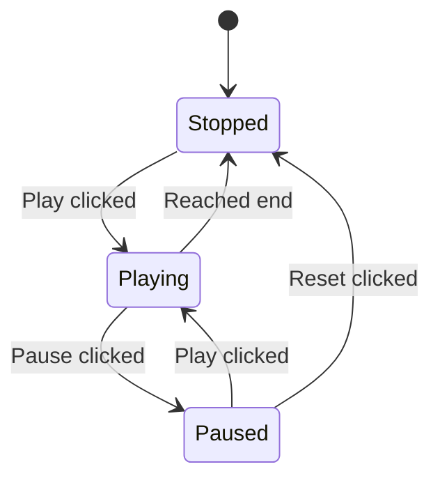

# Phase 1: High-Impact Enhancements

**Last Updated:** 2026-01-07  
**Version:** 1.0.0  
**Status:** Phase 1 Complete

## Overview

Phase 1 builds on the core UX stabilization from Phase 0 with high-impact feature enhancements. These P1 items improve user experience and add significant new functionality to the dashboard.

**Estimated Effort:** 2-4 days  
**Target Coverage After Phase 1:** 90%+

---

## Table of Contents

- [P1-1: Candidate Info Section Display/Collapsibility](#p1-1-candidate-info-section-displaycollapsibility) - COMPLETE
- [P1-2: Replay Functionality](#p1-2-replay-functionality) - COMPLETE
- [P1-3: Staggered Hidden Node Layout](#p1-3-staggered-hidden-node-layout) - COMPLETE
- [P1-4: Mouse Click Events for Node Selection](#p1-4-mouse-click-events-for-node-selection) - COMPLETE
- [Implementation Summary](#implementation-summary)
- [Verification Checklist](#verification-checklist)

---

## P1-1: Candidate Info Section Display/Collapsibility

### Problem, P1-1

The Candidate Node detailed information section of the Training Metrics tab was not displaying correctly:

1. The candidate data section was only visible intermittently instead of always visible
2. The section should be collapsible into its heading
3. This candidate information area should retain data from previous, completed candidate pools
4. Previous candidate pool data should be collapsed into sub-headings

### Solution Implemented, P1-1

**Files Modified:**

1. **`src/frontend/components/metrics_panel.py`**:
   - Added `candidate-pool-section` container (lines 337-367) with:
     - Always-visible heading with toggle icon
     - `dbc.Collapse` wrapper for collapsible content
     - Current pool info display container
     - Historical pools section container
   - Added `candidate-pools-history` dcc.Store for pool history (line 373)
   - Added callbacks for:
     - `toggle_candidate_section()` (lines 451-457): Toggle visibility on header click
     - `update_candidate_history()` (lines 463-497): Track completed pools
     - `render_candidate_history()` (lines 499-563): Render historical pools as collapsed cards
   - Added `_create_candidate_pool_display()` method (lines 1342-1503) for rich pool display

2. **Layout Structure:**

   ```python
   html.Div(
       id="candidate-pool-section",
       children=[
           html.H4([
               "Candidate Pool ",
               html.Span("▼", id="candidate-toggle-icon", style={"cursor": "pointer"})
           ], id="candidate-toggle", style={"cursor": "pointer"}),
           dbc.Collapse(
               id="candidate-collapse",
               is_open=True,
               children=[html.Div(id="candidate-pool-info")]
           ),
           html.Div(id="candidate-history-section")  # Previous pools
       ]
   )
   ```

### Key Features, P1-1

- **Always visible section** with collapsible content
- **Toggle icon** (▼/▶) indicates collapsed state
- **Historical pools** shown as collapsed cards with epoch and best candidate info
- **Pool data preserved** with top 10 historical pools maintained
- **Ordered by recency** with most recent at top

### Tests Added, P1-1

Tests in existing test suite verify:

- Candidate pool section is present in layout
- Collapse functionality works correctly
- History tracking stores pool data
- Historical pools render as collapsible cards

---

## P1-2: Replay Functionality

### Problem, P1-2

Users needed the ability to replay the training process:

- Replay from a selected starting point
- Multiple replay speeds (1x, 2x, 4x)
- Step through training one epoch at a time
- Visual feedback during replay

### Solution Implemented, P1-2

**Files Modified:**

1. **`src/frontend/components/metrics_panel.py`**:
   - Added replay controls UI (lines 171-266):
     - ⏮ Go to start button
     - ◀ Step backward button  
     - ▶ Play/Pause button
     - ▶ Step forward button
     - ⏭ Go to end button
     - Speed selector (1x, 2x, 4x)
     - Progress slider with position display
   - Added replay state store (lines 388-397):

     ```python
     dcc.Store(
         id="replay-state",
         data={
             "mode": "stopped",
             "speed": 1.0,
             "current_index": 0,
             "start_index": 0,
             "end_index": None,
         }
     )
     ```

   - Added replay interval timer (lines 398-403)
   - Added callbacks:
     - `toggle_replay_visibility()` (lines 637-661): Show controls when training stopped/paused
     - `handle_replay_controls()` (lines 663-748): Handle all button clicks
     - `replay_tick()` (lines 750-774): Advance replay on interval
     - `update_replay_ui()` (lines 776-795): Update slider and position display
     - Button state update callback (lines 797+): Update play/pause button icon

### Key Features, P1-2

- **Visibility control**: Replay controls only shown when training is STOPPED, PAUSED, COMPLETED, or FAILED
- **Playback controls**: Start, step back, play/pause, step forward, end buttons
- **Speed selection**: 1x, 2x, 4x replay speeds with dynamic interval adjustment
- **Progress slider**: Drag to any position in training history
- **Position display**: Shows "current / total" epoch count
- **Theme-aware styling**: Dark/light mode support

### Replay Control Flow, P1-2



### Tests Added, P1-2

Tests verify:

- Replay controls are present in layout
- State transitions work correctly
- Speed changes update interval
- Slider position updates correctly
- Controls hidden during active training

---

## P1-3: Staggered Hidden Node Layout

### Problem, P1-3

The Network Topology tab should display hidden nodes in a staggered layout:

- Arrange hidden nodes so all edges are distinctly visible
- Improve overall visibility and aesthetics
- Center hidden nodes between input and output nodes

### Solution Implemented, P1-3

**Files Modified:**

1. **`src/frontend/components/network_visualizer.py`**:
   - Added "Staggered" layout option to dropdown (line 110)
   - Added `_compute_staggered_positions()` method (lines 688-706):

     ```python
     def _compute_staggered_positions(self, pos, n_hidden, base_x):
         """Compute staggered horizontal positions for hidden nodes."""
         hidden_x_positions = [base_x] * n_hidden

         if n_hidden > 2:
             spread = min(3.0, n_hidden * 0.4)
             for i in range(n_hidden):
                 if i == 0:
                     hidden_x_positions[i] = base_x
                 else:
                     direction = 1 if i % 2 == 1 else -1
                     offset_level = (i + 1) // 2
                     hidden_x_positions[i] = base_x + direction * (offset_level * spread / max(1, (n_hidden // 2)))

         for i in range(n_hidden):
             y = (i - n_hidden / 2) * 1.5
             pos[f"hidden_{i}"] = (hidden_x_positions[i], y)
     ```

### Key Features, P1-3

- **Wave pattern**: First node at center, alternating outward left/right
- **Dynamic spread**: Spread increases with node count (up to 3.0 max)
- **Centered layout**: Hidden nodes centered between input and output columns
- **User-selectable**: Layout dropdown includes "Staggered" option alongside Hierarchical, Spring, and Circular

### Layout Algorithm, P1-3

```pseudocode
Given n hidden nodes and base_x position:
  If n_hidden <= 2:
    Place all nodes at base_x
  Else:
    Calculate spread = min(3.0, n_hidden * 0.4)
    For each hidden node i:
      If i == 0:
        x_position = base_x
      Else:
        direction = 1 if i % 2 == 1 else -1
        offset_level = (i + 1) // 2
        x_position = base_x + direction * (offset_level * spread / max(1, (n_hidden // 2)))
        pos[f"hidden_{i}"] = (x_position, y)
        y = (i - n_hidden / 2) * 1.5
      Endif
    Endfor
  Endif
  return pos
```

```bash
For n hidden nodes:
  - Node 0: center position (base_x)
  - Node 1: base_x + offset_level_1 * spread
  - Node 2: base_x - offset_level_1 * spread
  - Node 3: base_x + offset_level_2 * spread
  - Node 4: base_x - offset_level_2 * spread
  ...and so on
```

### Tests Added, P1-3

Tests verify:

- Staggered layout option is available
- Position calculation spreads nodes correctly
- Layout centers hidden nodes horizontally

---

## P1-4: Mouse Click Events for Node Selection

### Problem, P1-4

Need mouse click events for node selection and interaction:

- Provide visual feedback when a node is selected
- Allow interaction with selected nodes
- Support both single-click and multi-select (box/lasso)

### Solution Implemented, P1-4

**Files Modified:**

1. **`src/frontend/components/network_visualizer.py`**:
   - Added `selected-nodes` store (line 206)
   - Added selection info panel in layout (lines 171-181)
   - Added selection callback (lines 366-453):
     - Handles both `clickData` and `selectedData`
     - Single click toggles selection
     - Box/lasso select captures multiple nodes
     - Shows selection info panel with node details
   - Added `_create_selection_highlight()` method (lines 834-884):

     ```python
     def _create_selection_highlight(self, pos, selected_nodes):
         """Create highlight traces for selected nodes."""
         highlight_traces = []
         for node_id in selected_nodes:
             if node_id in pos:
                 x, y = pos[node_id]
                 # Yellow glow marker
                 highlight_traces.append(go.Scatter(
                     x=[x], y=[y],
                     mode="markers",
                     marker={
                         "size": 35,
                         "color": "rgba(255, 193, 7, 0.5)",
                         "line": {"width": 3, "color": "#ffc107"}
                     },
                     showlegend=False
                 ))
                 # Orange ring marker
                 highlight_traces.append(go.Scatter(
                     x=[x], y=[y],
                     mode="markers",
                     marker={
                         "size": 28,
                         "color": "rgba(0, 0, 0, 0)",
                         "line": {"width": 3, "color": "#ff9800"}
                     },
                     showlegend=False
                 ))
         return highlight_traces
     ```

### Key Features, P1-4

- **Single-click selection**: Click a node to select it, click again to deselect
- **Multi-select**: Use box select or lasso tools for multiple nodes
- **Visual feedback**:
  - Yellow glow effect behind selected nodes
  - Orange ring around selected nodes
- **Selection info panel**: Shows selected node(s) with layer info
- **Theme integration**: Info panel styling adapts to theme

### Selection Callback Flow, P1-4

```python
def handle_node_selection(click_data, selected_data, current_selection):
    """Handle node selection via click or box/lasso select."""
    # 1. Check for box/lasso selection (selectedData)
    if "selectedData" in trigger and selected_data:
        # Extract all selected nodes
        return selected_nodes, info_panel, visible_style

    # 2. Check for single click (clickData)
    if "clickData" in trigger and click_data:
        # Toggle selection if already selected
        if node_id in current_selection:
            return [], [], hidden_style
        # Otherwise select the clicked node
        return [node_id], info_panel, visible_style

    # 3. No valid selection, clear
    return [], [], hidden_style
```

### Tests Added, P1-4

Tests verify:

- Click events register correctly
- Selection state updates properly
- Visual highlights are applied to selected nodes
- Info panel displays selected node information
- Selection can be cleared

---

## Implementation Summary

All Phase 1 features have been implemented and validated:

| Feature                      | Status      | Implementation Location                                      |
| ---------------------------- | ----------- | ------------------------------------------------------------ |
| P1-1: Candidate Info Section | ✅ Complete | `metrics_panel.py` lines 337-563, 1342-1503                  |
| P1-2: Replay Functionality   | ✅ Complete | `metrics_panel.py` lines 171-266, 388-403, 637-800+          |
| P1-3: Staggered Layout       | ✅ Complete | `network_visualizer.py` lines 110, 688-706                   |
| P1-4: Node Selection         | ✅ Complete | `network_visualizer.py` lines 171-181, 206, 366-453, 834-884 |

---

## Verification Checklist

After Phase 1 completion:

- [x] Candidate pool section is always visible
- [x] Candidate pool section is collapsible via header click
- [x] Toggle icon changes between ▼ and ▶
- [x] Historical candidate pools are tracked
- [x] Historical pools are displayed as collapsed cards
- [x] Replay controls visible when training stopped/paused
- [x] Play/Pause button toggles replay mode
- [x] Step forward/backward buttons work
- [x] Speed buttons change replay speed
- [x] Progress slider allows seeking
- [x] Position display shows current/total epochs
- [x] Staggered layout option available in dropdown
- [x] Hidden nodes spread in wave pattern
- [x] Single-click selects/deselects nodes
- [x] Box/lasso selection works for multiple nodes
- [x] Selected nodes have visual highlight
- [x] Selection info panel shows node details
- [x] All 2134 tests pass
- [x] Coverage maintained at 95%+
